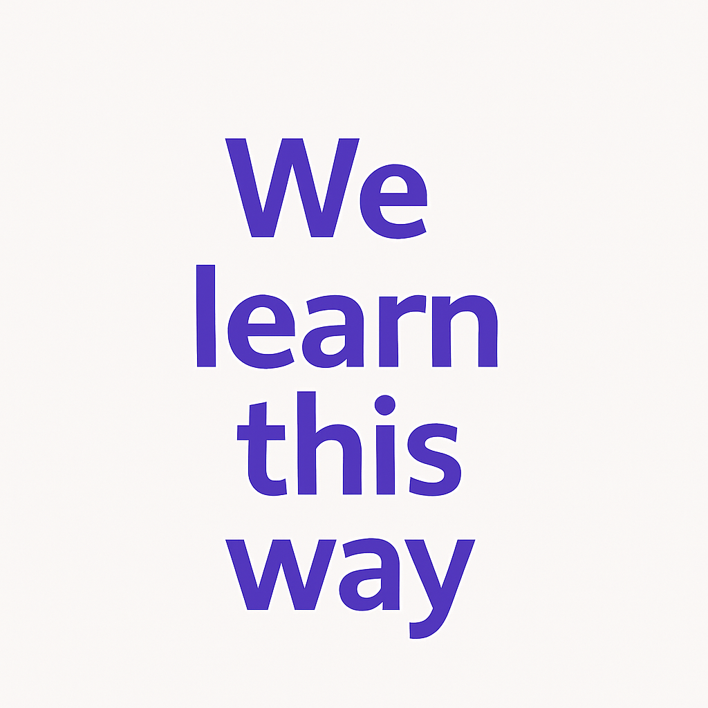

  <h1>El Antimétodo</h1>
  
Aprende idiomas <strong>sin gramática</strong>, de forma <strong>natural y divertida</strong>

  

    

      <h2>🎯 Sin Estrés</h2>
      
Olvida ejercicios aburridos - aprende con contenido que disfrutas

    

    

      <h2>⏱️ A Tu Ritmo</h2>
      
Usa tu tiempo libre: series, música, videojuegos

    

  

<!-- CONTENIDO PRINCIPAL -->
<main style="max-width: 800px; margin: 0 auto; padding: 0 1rem;">

  <!-- SECCIÓN QUÉ ES -->
  <section style="margin-bottom: 3rem;">
    <h2 style="
      color: #4a148c;
      border-bottom: 2px solid #d1c4e9;
      padding-bottom: 0.5rem;
    ">¿Qué es el Antimétodo?</h2>
    
    
El Antimétodo es un enfoque revolucionario para aprender idiomas basado en la teoría del input comprensible de Stephen Krashen. A diferencia de los métodos tradicionales, que se centran en la memorización de reglas gramaticales, traducciones y ejercicios formales, el Antimétodo propone aprender un idioma de manera natural, intuitiva y personalizada. Permitiendo que cualquier persona pueda avanzar hasta la fluidez a su propio ritmo, usando herramientas gratuitas y contenido real en el idioma. Todo mientras el estudiante autodidacta hace cosas que le gustan, como ver series, películas, videojuegos. Sin sufrir en el proceso, de manera fácil, placentera, efectiva y natural.

    
    
La idea central es que el aprendizaje ocurre cuando te expones de forma constante y masiva a contenido real y comprensible en el idioma que quieres aprender. De esta forma, el idioma se adquiere igual que aprendimos nuestra lengua materna: entendiendo mensajes, disfrutando el proceso y sin presión por producir desde el principio.

    
    

      
    

  </section>

  <!-- SECCIÓN POR QUÉ FUNCIONA -->
  <section style="margin-bottom: 3rem;">
    <h2 style="
      color: #4a148c;
      border-bottom: 2px solid #d1c4e9;
      padding-bottom: 0.5rem;
    ">¿Por qué funciona?</h2>
    
    <h3 style="color: #7b1fa2;">Hipótesis de la adquisición y aprendizaje de idiomas</h3>
    
Esta hipótesis busca describir que existen dos maneras de desarrollar habilidades en el idioma, mediante adquisición y aprendizaje, la adquisición es un proceso inconsciente en el que no nos damos cuenta que está pasando, sucede cuando estamos expuestos con el idioma recibiendo input comprensible (input es todo lo que recibimos del idioma), no se trata solamente de estar expuestos al idioma si no de poder entender una parte del input y estar respaldados de un contexto que nos permita deducir el significado. Si te dicen esta palabra "hund" probablemente no vayas a saber que es, pero si ves por ejemplo a una persona que está en un parque caminando con su perro. De repente, se acerca un amigo y dice:

    
    

      « Dein Hund ist wirklich süß! »
    

    
    
Ves que la persona está señalando al perro, y en ese momento entiendes que Hund significa perro en alemán, aunque aún no sabías la palabra.

    
    <h3 style="color: #7b1fa2; margin-top: 2rem;">La hipótesis del monitor</h3>
    
"Cuando yo era pequeño me gustaba jugar los juguetes" Sí leíste esta oración probablemente veas algo mal con esta oración, que le falta una "a" para que sea correcta gramaticalmente a pesar de no tener idea de la gramática del español, esto es gracias al monitor adquirido, sentimos que esta mal a pesar de no saber de que es o por qué. Comparado con este deberíamos saber lo que es el monitor aprendido de manera consciente que es el que aprendemos habitualmente mediante gramática y clases tradicionales, el monitor aprendido conscientemente, aunque puede corregir errores, no resulta tan útil en el habla, ya que interfiere con la fluidez del habla. Esto se debe a que debes saber para empezar las reglas cuando incluso los investigadores de lengua o autores de libros de gramática no conocen todas las reglas del idioma, para utilizar el monitor también necesitas tiempo que en una conversación normal no tienes, debes pensar sobre la forma correcta y el significado a la misma vez, hablar idiomas se convierte en un proceso molesto traduciendo desde tu idioma natal y siguiendo fórmulas matemáticas para hablar. En cambio, el monitor adquirido de forma natural a través de input comprensible y repetido se activa de manera automática, permitiendo correcciones más intuitivas sin obstaculizar la comunicación. Este monitor "implícito" mejora con el tiempo y la exposición constante, y refleja un conocimiento más profundo y funcional del idioma.

  </section>

  <!-- SECCIÓN BENEFICIOS -->
  <section style="margin-bottom: 3rem;">
    <h2 style="
      color: #4a148c;
      border-bottom: 2px solid #d1c4e9;
      padding-bottom: 0.5rem;
    ">Beneficios del antimétodo</h2>
    
    

      

        <h3 style="color: #7b1fa2; margin-top: 0;">Flexible y personalizado</h3>
        
Se adapta a cada estudiante según sus intereses, nivel y ritmo.

      

      
      

        <h3 style="color: #7b1fa2; margin-top: 0;">Aprovecha tu tiempo</h3>
        
Sustituye tiempo en redes sociales por aprendizaje placentero.

      

      
      

        <h3 style="color: #7b1fa2; margin-top: 0;">Fluidez natural</h3>
        
Habla sin traducir, con un "instinto" similar al nativo.

      

      
      

        <h3 style="color: #7b1fa2; margin-top: 0;">Accesible</h3>
        
No requiere pagar cursos caros, solo internet y contenido.

      

      
      

        <h3 style="color: #7b1fa2; margin-top: 0;">Hábitos sostenibles</h3>
        
Construye disciplina sin depender de motivación.

      

      
      

        <h3 style="color: #7b1fa2; margin-top: 0;">Etapas claras</h3>
        
Proceso bien definido y fácil de seguir.

      

      
      

        <h3 style="color: #7b1fa2; margin-top: 0;">Autoaprendizaje real</h3>
        
Capacidad de aprender cualquier idioma por ti mismo.

      

    

    
    

      
    

  </section>

  <!-- SECCIÓN EL ANTIMÉTODO -->
  <section style="margin-bottom: 3rem;">
    <h2 style="
      color: #4a148c;
      border-bottom: 2px solid #d1c4e9;
      padding-bottom: 0.5rem;
    ">El antimétodo</h2>
    
    
Antes de comenzar tendríamos que saber diferenciar entre las principales actividades que podrías seguir en el método:

    
    <h3 style="color: #7b1fa2; margin-top: 1.5rem;">Inmersión activa</h3>
    
Esta es la actividad más importante en el aprendizaje de idiomas, es cuando prestas toda tu atención al contenido intentando deducir por el contexto, dentro de esta categoría entra la inmersión libre (freeflow) que es sin buscar nada o casi nada significados de palabras aprendiendo por input comprensible.

    
    <h3 style="color: #7b1fa2; margin-top: 1.5rem;">Inmersión intensiva</h3>
    
Es cuando utilizas un diccionario emergente en tu inmersión buscando en cada frase para saber su significado y entender la frase. Nosotros no recomendamos muy poco este tipo de inmersión porque puede llegar a ser tedioso o una carga y puede reducir tu tiempo total bruto en el idioma.

    
    <h3 style="color: #7b1fa2; margin-top: 1.5rem;">Inmersión pasiva</h3>
    
Es cuando se presta una atención parcial al idioma, pueden ser podcast o audios, este tipo de inmersión puede ser increíblemente beneficiosa si es utilizada de manera correcta. Si bien al no prestar mucha atención se pierden muchos de los beneficios al sí hacerlo, puede ayudarte a incrementar muchísimo tu tiempo de exposición al idioma, lo cual ayuda realmente a gente ocupada, no remplaza a la inmersión activa y es completamente opcional, pero puede ayudarte a acelerar el proceso.

  

  <h4 style="color: #4a148c; margin-bottom: 1rem;">¿Te gustó la idea de la inmersión pasiva?</h4>
  

    Este video puede darte un ejemplo claro de cómo adaptar tu entorno para que el idioma esté siempre presente. 
    Si estás siguiendo el Antimétodo, esto te podría ayudar a aumentar exponencialmente tus horas de exposición al idioma sin esfuerzo adicional.
  

  

    Recomendamos la inmersión pasiva a partir de la segunda etapa, cuando ya puedas entender una parte de lo que escuchas pasivamente.
    Si bien en la inmersión pasiva no prestas una atención absoluta, te sugerimos dar un poco de atención al contenido para obtener mejores resultados.
  

  

    <iframe width="100%" height="315" 
            src="https://www.youtube.com/embed/SSWabajK1Sc" 
            title="Ejemplo de inmersión pasiva" 
            frameborder="0" 
            allow="accelerometer; autoplay; clipboard-write; encrypted-media; gyroscope; picture-in-picture; web-share" 
            allowfullscreen
            style="
              max-width: 560px;
              width: 100%;
              border: 3px solid #d1c4e9;
              border-radius: 8px;
              box-shadow: 0 4px 10px rgba(74, 20, 140, 0.2);
            ">
    </iframe>
  

    
    <h3 style="color: #7b1fa2; margin-top: 1.5rem;">Estudio activo</h3>
    
Este es realmente opcional para nosotros pero puede tener grandes beneficios, abarca actividades como estudiar la fonética, vocabulario con anki y estudiar el sistema de escritura, en la mayoría de idiomas aprender la fonética y el sistema de escritura te pueden tomar menos de una semana de aprender.

  </section>

  <!-- SECCIÓN ETAPAS -->
  
<section style="margin-bottom: 3rem;">
  <h2 style="
    color: #4a148c;
    border-bottom: 2px solid #d1c4e9;
    padding-bottom: 0.5rem;
  ">Primera etapa: preparación previa</h2>
  
  
El objetivo de esto es utilizarla como una rampa de acceso para lanzarnos más fácilmente al input real, porque es mucho más eficaz que lanzarnos a la inmersión de una, ya que el input debe ser en parte comprensible.

  
  
Para este paso recomendamos empezar aprendiendo vocabulario mediante una aplicación de repetición espaciada (Anki) con un mazo de 1000 palabras más comunes (NO BÁSICAS) en el idioma. Para esto recomendamos los <a href="https://refold.la/es/category/decks/" target="_blank">mazos de Refold</a>. Ten en cuenta que estos mazos tienen un costo. Si buscas opciones gratuitas, puedes explorar cientos de mazos populares creados por la comunidad en <a href="https://ankiweb.net/shared/decks" target="_blank">AnkiWeb</a>.

  
  
<strong>Utilizar aplicaciones de idiomas:</strong> estas aplicaciones no te pueden llevar a un nivel avanzado ni a la fluidez, pero pueden ayudarte a construir las bases. Recomendamos especialmente <strong>Busuu</strong>.

  
  
<strong>Otras alternativas:</strong> Son totalmente opcionales y dependen de cada persona. La piedra angular de este método es que lo disfrutes y hagas actividades que te gusten: fonética, gramática, cursos de idiomas, etc.

  
  
<strong>¿Es la gramática necesaria?</strong> No recomendamos el estudio formal de gramática en esta etapa, y sostenemos que puedes aprender cualquier idioma sin tocarla. Sin embargo, si disfrutas estudiar gramática, puedes usarla como apoyo básico en esta primera etapa de preparación para comprender mejor las estructuras, o más adelante en la etapa de output para refinar detalles.

  
  
Recomendamos firmemente el uso de <a href="https://play.google.com/store/apps/details?id=com.refoldla.habitsmobile&hl=en" target="_blank"><strong>Refold Tracker</strong></a>. Es una aplicación que te permite registrar el tiempo que pasas en tu idioma y en qué actividades. Te ayudará a crear el hábito y a tener claridad sobre tus horas reales de exposición.

</section>

  <!-- SECCIÓN FREE FLOW -->
  <section style="margin-bottom: 3rem;">
    <h2 style="
      color: #4a148c;
      border-bottom: 2px solid #d1c4e9;
      padding-bottom: 0.5rem;
    ">Tercera etapa: Free Flow Listening</h2>
    
    
Después de haber pasado un cierto tiempo nos daremos cuenta que entendemos bastante bien el idioma, en este punto aprenderemos a independizarnos de los subtítulos para entender sin necesidad de ellos. Para este paso recomendamos el freeflow listening, es básicamente consumir el contenido sin subtítulos junto con (opcional) intensive listening, este demanda mucha energía y puede llegar a ser hasta aburrido, consiste en escuchar un mismo dialogo hasta 3 veces analizando las voces para en la cuarta leer lo que dicen y escuchar una vez más.

    
    
En esta etapa entenderemos muy bien y probablemente haya varias oraciones i+1 donde haya una palabra que desconozcamos en el mismo enunciado, el minado de oraciones consiste en minar la oración completa i+1 en anki, creando una tarjeta con la imagen del contenido que estemos viendo con la oración completa traducida al español, para entender el significado de la palabra en ese contexto en específico, no recomendamos en lo absoluto minar solo la palabra ya que suelen cambiar de significado según el contexto.

  </section>

  <!-- SECCIÓN PRODUCCIÓN -->
  <section style="margin-bottom: 3rem;">
    <h2 style="
      color: #4a148c;
      border-bottom: 2px solid #d1c4e9;
      padding-bottom: 0.5rem;
    ">Cuarta etapa: Producción del idioma</h2>
    
    
Imagina que, durante todo este proceso de input, tu cerebro ha estado construyendo una máquina compleja. Una máquina diseñada para entender el idioma: con engranes, sensores y cables que se activan cada vez que escuchas, ves o lees algo en esa lengua. Al principio, era lenta, torpe, apenas encendía. Pero con cada día de exposición, con cada minuto de inmersión, la máquina fue tomando forma. Se ajustó, se afinó, se volvió eficiente.

    
    
Y entonces sucede algo mágico: esa misma máquina, que parecía creada solo para entender, puede invertirse. Es como si le dieras vuelta a su mecanismo. Lo que antes era input, ahora puede ser output. La comprensión se convierte en producción. Ya no solo reconoces estructuras, sonidos o palabras; ahora puedes usarlas. La máquina está lista para hablar, para escribir, para crear con el idioma.

    
    
Aquí empieza esa transición. Si bien existen casos documentados de personas que fueron fluidas solo con recibir input ese no es el caso con la mayoría, y tenemos que practicar mucho para llegar a la fluidez, Para lograr esto tenemos que primero diferencias entre lo que podemos lograr con escribir y hablar. El speaking ayuda más que nada a hablar más de manera fluida, pero tiene sus problemas, notaras muy fácilmente tus errores y el problema es de que no tendrás el tiempo de solucionarlos, en la escritura en cambio tendremos más tiempo para buscar algo que no recordamos como decir, activando el input en output, y teniendo más tiempo para corregir fácilmente, recomendamos como actividades escribir y hacer llamadas con inteligencia artificial, haciendo énfasis en hacer una conversación fluida, donde te corrija y siga el flujo de la conversación a la vez, será muy fácil corregir los errores ya que con las horas de input serán obvios los errores. Otra de las actividades es simplemente hablar consigo mismo puede ser mentalmente o en voz alta, o llevar un diario. Aquí recomendamos 1 hora de output (producir el idioma) y una hora de input.

    
    

      
    

  </section>

  <!-- SECCIÓN RECURSOS -->
  <section style="margin-bottom: 3rem;">
    <h2 style="
      color: #4a148c;
      border-bottom: 2px solid #d1c4e9;
      padding-bottom: 0.5rem;
    ">Proximamente...</h2>
    
    
Esta es solo la primera versión del sitio web del Antimétodo. Apenas estamos comenzando. La página está en pleno desarrollo y aún faltan muchos recursos, herramientas, ejemplos y guías prácticas que iremos construyendo poco a poco. Lo que acabas de leer es solo el inicio de algo mucho más grande. Se vienen cosas importantes, y esto apenas comienza.

    
    

      
    

  </section>
</main>

<!-- ESTILOS ADICIONALES -->

